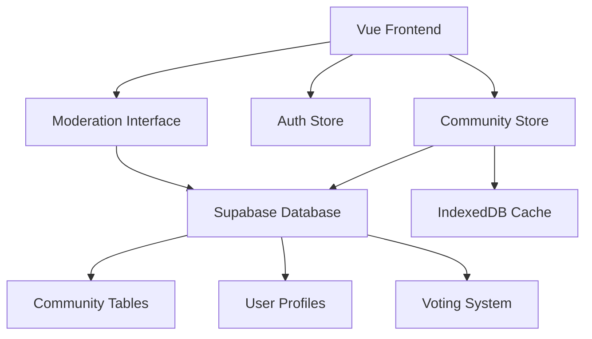

# Design Document

## Overview

The Community Content system extends the existing Taiwanese dictionary app with user-generated content capabilities. It integrates seamlessly with the current dual-storage architecture (IndexedDB + Supabase) while adding new social features including content submission, voting, moderation, and reputation systems.

## Architecture

### High-Level Architecture



### Database Schema Extensions

**New Supabase Tables:**

1. **community_definitions**
   - id (uuid, primary key)
   - word_id (text, references original word)
   - user_id (uuid, references auth.users)
   - definition (text)
   - usage_example (text, optional)
   - tags (text array)
   - context (text, optional)
   - status (enum: pending, approved, rejected, hidden)
   - created_at (timestamp)
   - updated_at (timestamp)
   - moderator_notes (text, optional)

2. **community_votes**
   - id (uuid, primary key)
   - definition_id (uuid, references community_definitions)
   - user_id (uuid, references auth.users)
   - vote_type (enum: upvote, downvote)
   - created_at (timestamp)
   - unique constraint on (definition_id, user_id)

3. **user_profiles**
   - user_id (uuid, references auth.users)
   - username (text, unique)
   - reputation_score (integer, default 0)
   - role (enum: user, moderator, admin)
   - contribution_count (integer, default 0)
   - created_at (timestamp)

4. **content_reports**
   - id (uuid, primary key)
   - definition_id (uuid, references community_definitions)
   - reporter_id (uuid, references auth.users)
   - reason (text)
   - status (enum: pending, resolved, dismissed)
   - created_at (timestamp)

## Components and Interfaces

### New Vue Components

1. **CommunityDefinitionForm.vue**
   - Form for submitting new community definitions
   - Fields: definition, usage example, tags, context
   - Validation and submission handling
   - Mobile-responsive design

2. **CommunityDefinitionCard.vue**
   - Displays individual community definitions
   - Voting buttons with real-time updates
   - Author information and timestamps
   - Visual distinction from official content

3. **VotingButtons.vue**
   - Reusable upvote/downvote component
   - Handles authentication checks
   - Prevents self-voting
   - Shows current vote state

4. **CommunityModerationPanel.vue**
   - Admin interface for content review
   - Bulk actions for approval/rejection
   - Filtering and search capabilities
   - Moderator notes and feedback

5. **UserContributions.vue**
   - Profile page showing user's submissions
   - Contribution statistics and reputation
   - Status tracking for submissions

### Store Extensions

**New Pinia Store: communityStore.js**

```javascript
// Key state properties
{
  communityDefinitions: [],
  userVotes: new Map(),
  userProfile: null,
  pendingSubmissions: [],
  moderationQueue: []
}

// Key actions
- submitDefinition()
- voteOnDefinition()
- fetchCommunityContent()
- moderateContent()
- updateUserProfile()
```

### API Integration

**New Supabase Functions:**
- Real-time subscriptions for vote updates
- Row Level Security (RLS) policies for content access
- Database functions for vote counting and reputation calculation
- Triggers for automatic reputation updates

## Data Models

### CommunityDefinition Model
```typescript
interface CommunityDefinition {
  id: string
  wordId: string
  userId: string
  definition: string
  usageExample?: string
  tags: string[]
  context?: string
  status: 'pending' | 'approved' | 'rejected' | 'hidden'
  voteScore: number
  userVote?: 'upvote' | 'downvote'
  author: {
    username: string
    reputation: number
  }
  createdAt: Date
  updatedAt: Date
}
```

### Vote Model
```typescript
interface Vote {
  id: string
  definitionId: string
  userId: string
  voteType: 'upvote' | 'downvote'
  createdAt: Date
}
```

## Error Handling

### Client-Side Error Handling
- Network connectivity checks before submission
- Optimistic UI updates with rollback on failure
- User-friendly error messages for common scenarios
- Offline queue for pending actions

### Server-Side Error Handling
- Input validation and sanitization
- Rate limiting for submissions and votes
- Duplicate submission prevention
- Graceful degradation when community features unavailable

### Error Scenarios
1. **Submission Failures**: Show retry options, save draft locally
2. **Voting Conflicts**: Handle concurrent vote changes gracefully
3. **Authentication Issues**: Redirect to login, preserve user intent
4. **Content Moderation**: Clear feedback on rejection reasons

## Testing Strategy

### Unit Tests
- Community store actions and mutations
- Vote calculation logic
- Form validation components
- User permission checks

### Integration Tests
- End-to-end submission workflow
- Voting system with real-time updates
- Moderation approval/rejection flow
- Mobile responsive behavior

### User Acceptance Tests
- Community member can submit and vote on content
- Moderators can effectively manage submissions
- Content quality improves through voting system
- Mobile users have full functionality

## Security Considerations

### Authentication & Authorization
- All community actions require authentication
- Role-based access control for moderation features
- Rate limiting to prevent spam and abuse
- Input sanitization for all user content

### Content Security
- XSS prevention in user-generated content
- Content filtering for inappropriate material
- Spam detection algorithms
- User reporting and flagging system

### Data Privacy
- User vote history privacy controls
- Optional anonymous contributions
- GDPR compliance for user data
- Content deletion and user account removal

## Performance Considerations

### Caching Strategy
- Cache community content in IndexedDB for offline access
- Implement pagination for large result sets
- Use virtual scrolling for long lists
- Cache vote counts and user reputation

### Real-time Updates
- WebSocket connections for live vote updates
- Debounced API calls for rapid interactions
- Optimistic UI updates for better UX
- Background sync for offline actions

### Scalability
- Database indexing for vote queries
- Content archival for old submissions
- CDN caching for static community content
- Horizontal scaling considerations for high traffic