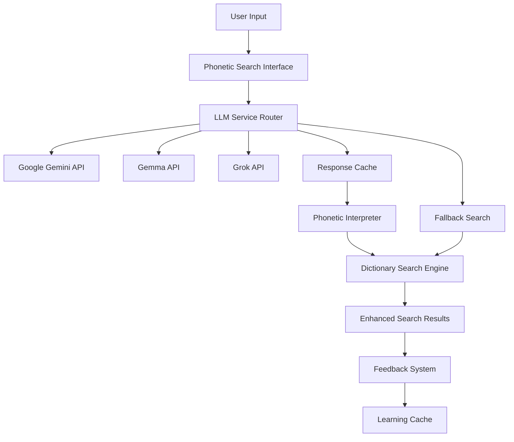
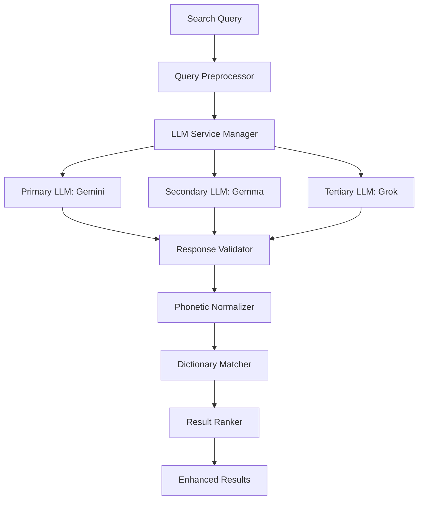

# Design Document

## Overview

The LLM Phonetic Search system integrates modern Large Language Models to provide intelligent phonetic matching for Taiwanese romanization across multiple systems. The system uses free LLM services (Google Gemini, Gemma, or Grok) to interpret user input without tone marks or diacritics, converting approximate phonetic spellings into accurate romanization in various systems including Tâi-lô, POJ (Pe̍h-ōe-jī), TLPA, and others. The design emphasizes performance, privacy, and fallback reliability while providing educational feedback to users about different romanization systems.

## Architecture

### High-Level Architecture



### LLM Service Integration Architecture



## Components and Interfaces

### LLM Service Manager

**Core LLM Integration Class:**
```javascript
class LLMPhoneticService {
  constructor() {
    this.services = [
      new GeminiService(),
      new GemmaService(), 
      new GrokService()
    ];
    this.cache = new PhoneticCache();
    this.rateLimiter = new RateLimiter();
  }

  async interpretPhonetic(userInput, options = {}) {
    // Check cache first
    const cached = await this.cache.get(userInput);
    if (cached && !cached.isExpired()) {
      return cached.result;
    }

    // Try services in priority order
    for (const service of this.services) {
      try {
        if (await this.rateLimiter.canMakeRequest(service.name)) {
          const result = await service.interpretPhonetic(userInput, options);
          await this.cache.set(userInput, result);
          return result;
        }
      } catch (error) {
        console.warn(`${service.name} failed:`, error);
        continue;
      }
    }

    // Fallback to traditional fuzzy search
    return this.fallbackSearch(userInput);
  }
}
```

### Individual LLM Service Implementations

**Google Gemini Integration:**
```javascript
class GeminiService {
  constructor() {
    this.apiKey = process.env.VITE_GEMINI_API_KEY;
    this.baseUrl = 'https://generativelanguage.googleapis.com/v1beta';
    this.model = 'gemini-1.5-flash'; // Free tier model
  }

  async interpretPhonetic(input, options) {
    const prompt = this.buildPhoneticPrompt(input, options);
    
    const response = await fetch(`${this.baseUrl}/models/${this.model}:generateContent`, {
      method: 'POST',
      headers: {
        'Content-Type': 'application/json',
        'x-goog-api-key': this.apiKey
      },
      body: JSON.stringify({
        contents: [{
          parts: [{ text: prompt }]
        }],
        generationConfig: {
          temperature: 0.1,
          maxOutputTokens: 200
        }
      })
    });

    return this.parsePhoneticResponse(await response.json());
  }

  buildPhoneticPrompt(input, options) {
    const preferredSystem = options.romanizationSystem || 'tailo';
    
    return `
You are a Taiwanese language expert familiar with multiple romanization systems. Convert the following approximate phonetic input to proper Taiwanese romanization.

Input: "${input}"
Preferred system: ${preferredSystem}

Taiwanese Romanization Systems:
- Tâi-lô (Tâi-lô): Modern standard with tone marks (â, ê, î, ô, ū, etc.)
- POJ (Pe̍h-ōe-jī): Traditional missionary system with tone marks (â, ê, î, ô, û, etc.)
- TLPA: Uses numbers for tones (a1, a2, a3, etc.)
- Zhuyin-style: Uses bopomofo-like notation

Common sound mappings:
- "ng" sound: ng (Tâi-lô/POJ), ng (TLPA)
- "oo" sound: oo (Tâi-lô), o͘ (POJ), oo (TLPA)
- Tone markers: â/á/à/ah/ā/a̍/a̋ (Tâi-lô), â/á/à/ah/ā/a̍/a̋ (POJ), a5/a2/a3/a4/a1/a7/a8 (TLPA)

Rules:
1. Identify which romanization system the input might be using
2. Convert to the preferred system with proper tone marks/numbers
3. Provide alternatives in other systems if helpful
4. If multiple interpretations exist, provide up to 3 alternatives
5. Include confidence score (0-1) for each suggestion
6. Explain any corrections made and system conversions

Respond in JSON format:
{
  "interpretations": [
    {
      "romanization": "correct_romanization_here",
      "system": "tailo|poj|tlpa|mixed",
      "confidence": 0.95,
      "explanation": "explanation of changes made",
      "alternatives": {
        "tailo": "tâi-lô version",
        "poj": "POJ version", 
        "tlpa": "TLPA version"
      }
    }
  ],
  "detected_input_system": "tailo|poj|tlpa|mixed|unknown",
  "original_input": "${input}"
}
    `.trim();
  }
}
```

**Gemma Service (via Hugging Face):**
```javascript
class GemmaService {
  constructor() {
    this.apiKey = process.env.VITE_HF_API_KEY;
    this.baseUrl = 'https://api-inference.huggingface.co/models/google/gemma-2b-it';
  }

  async interpretPhonetic(input, options) {
    const prompt = this.buildGemmaPrompt(input);
    
    const response = await fetch(this.baseUrl, {
      method: 'POST',
      headers: {
        'Authorization': `Bearer ${this.apiKey}`,
        'Content-Type': 'application/json'
      },
      body: JSON.stringify({
        inputs: prompt,
        parameters: {
          max_new_tokens: 150,
          temperature: 0.1,
          return_full_text: false
        }
      })
    });

    return this.parseGemmaResponse(await response.json());
  }
}
```

### Vue Components

**PhoneticSearchInput.vue:**
```vue
<template>
  <div class="phonetic-search">
    <div class="search-input-container">
      <input
        v-model="searchQuery"
        @input="handleInput"
        @keyup.enter="performSearch"
        placeholder="Type Taiwanese sounds (e.g., 'ho bu' for 好無)"
        class="phonetic-input"
        :disabled="isProcessing"
      />
      <button 
        @click="performSearch"
        :disabled="!searchQuery || isProcessing"
        class="search-button"
      >
        <LoadingSpinner v-if="isProcessing" />
        <SearchIcon v-else />
      </button>
    </div>

    <!-- LLM Interpretation Display -->
    <div v-if="interpretation" class="interpretation-display">
      <h4>Interpreted as:</h4>
      <div class="interpretation-options">
        <button
          v-for="option in interpretation.interpretations"
          :key="option.romanization"
          @click="selectInterpretation(option)"
          class="interpretation-option"
          :class="{ active: selectedInterpretation === option }"
        >
          <span class="romanization">{{ option.romanization }}</span>
          <span class="confidence">{{ Math.round(option.confidence * 100) }}%</span>
        </button>
      </div>
      <p class="explanation">{{ selectedInterpretation?.explanation }}</p>
    </div>

    <!-- Fallback Notice -->
    <div v-if="usingFallback" class="fallback-notice">
      <InfoIcon />
      <span>Using basic search (LLM services unavailable)</span>
    </div>
  </div>
</template>

<script>
import { ref, computed } from 'vue';
import { usePhoneticSearch } from '@/composables/usePhoneticSearch';

export default {
  name: 'PhoneticSearchInput',
  setup() {
    const searchQuery = ref('');
    const { 
      interpretPhonetic, 
      isProcessing, 
      interpretation, 
      usingFallback 
    } = usePhoneticSearch();

    const selectedInterpretation = computed(() => 
      interpretation.value?.interpretations?.[0]
    );

    const handleInput = debounce(async () => {
      if (searchQuery.value.length > 2) {
        await interpretPhonetic(searchQuery.value);
      }
    }, 500);

    return {
      searchQuery,
      interpretation,
      selectedInterpretation,
      isProcessing,
      usingFallback,
      handleInput,
      performSearch: () => interpretPhonetic(searchQuery.value)
    };
  }
};
</script>
```

### Composable for LLM Integration

**usePhoneticSearch.js:**
```javascript
import { ref, reactive } from 'vue';
import { LLMPhoneticService } from '@/services/llmPhoneticService';

export function usePhoneticSearch() {
  const isProcessing = ref(false);
  const interpretation = ref(null);
  const usingFallback = ref(false);
  const error = ref(null);

  const llmService = new LLMPhoneticService();

  const interpretPhonetic = async (input) => {
    if (!input?.trim()) return;

    isProcessing.value = true;
    error.value = null;
    usingFallback.value = false;

    try {
      const result = await llmService.interpretPhonetic(input);
      
      if (result.isFallback) {
        usingFallback.value = true;
      }
      
      interpretation.value = result;
      
      // Trigger dictionary search with interpreted romanization
      if (result.interpretations?.length > 0) {
        await searchDictionary(result.interpretations[0].romanization);
      }
      
    } catch (err) {
      error.value = err.message;
      console.error('Phonetic interpretation failed:', err);
    } finally {
      isProcessing.value = false;
    }
  };

  const provideFeedback = async (originalInput, interpretation, isCorrect) => {
    try {
      await llmService.recordFeedback({
        input: originalInput,
        interpretation,
        correct: isCorrect,
        timestamp: new Date()
      });
    } catch (err) {
      console.error('Failed to record feedback:', err);
    }
  };

  return {
    isProcessing,
    interpretation,
    usingFallback,
    error,
    interpretPhonetic,
    provideFeedback
  };
}
```

## Data Models

### Phonetic Interpretation Model
```typescript
interface PhoneticInterpretation {
  interpretations: PhoneticOption[];
  originalInput: string;
  detectedInputSystem: RomanizationSystem;
  processingTime: number;
  llmService: string;
  isFallback: boolean;
  timestamp: Date;
}

interface PhoneticOption {
  romanization: string;
  system: RomanizationSystem;
  confidence: number;
  explanation: string;
  alternatives: RomanizationAlternatives;
  alternativeSpellings?: string[];
  tonePattern?: string;
}

interface RomanizationAlternatives {
  tailo?: string;
  poj?: string;
  tlpa?: string;
  zhuyin?: string;
}

type RomanizationSystem = 'tailo' | 'poj' | 'tlpa' | 'zhuyin' | 'mixed' | 'unknown';
```

### LLM Service Configuration
```typescript
interface LLMServiceConfig {
  name: string;
  apiKey: string;
  baseUrl: string;
  model: string;
  rateLimit: {
    requestsPerMinute: number;
    requestsPerDay: number;
  };
  priority: number;
  enabled: boolean;
}
```

### Cache Model
```typescript
interface PhoneticCacheEntry {
  input: string;
  result: PhoneticInterpretation;
  timestamp: Date;
  expiresAt: Date;
  hitCount: number;
}
```

## Error Handling

### LLM Service Error Handling
```javascript
class LLMErrorHandler {
  static handleServiceError(error, serviceName) {
    switch (error.status) {
      case 429:
        return {
          type: 'rate_limit',
          message: `${serviceName} rate limit exceeded`,
          retryAfter: error.headers?.['retry-after'] || 60,
          fallback: true
        };
      
      case 401:
        return {
          type: 'auth_error',
          message: `${serviceName} authentication failed`,
          fallback: true
        };
      
      case 503:
        return {
          type: 'service_unavailable',
          message: `${serviceName} temporarily unavailable`,
          fallback: true
        };
      
      default:
        return {
          type: 'unknown_error',
          message: `${serviceName} request failed`,
          fallback: true
        };
    }
  }

  static async handleWithFallback(primaryAction, fallbackAction) {
    try {
      return await primaryAction();
    } catch (error) {
      console.warn('Primary action failed, using fallback:', error);
      return await fallbackAction();
    }
  }
}
```

### Graceful Degradation Strategy
1. **Primary LLM fails** → Try secondary LLM
2. **All LLMs fail** → Use fuzzy string matching
3. **Network issues** → Use cached interpretations
4. **Rate limits hit** → Queue requests with user notification

## Testing Strategy

### Unit Tests
- LLM service integration and response parsing
- Phonetic interpretation accuracy with known test cases
- Cache functionality and expiration logic
- Rate limiting and fallback mechanisms

### Integration Tests
- End-to-end phonetic search workflow
- Multiple LLM service failover scenarios
- Mobile network condition simulation
- Privacy and data handling compliance

### Performance Tests
- Response time benchmarks for different query types
- Cache hit rate optimization
- Concurrent request handling
- Mobile device performance impact

## Security and Privacy Considerations

### Data Privacy
- **Query Anonymization**: Remove user identifiers before LLM requests
- **Local Processing**: Cache interpretations locally to reduce API calls
- **Opt-out Options**: Allow users to disable LLM features completely
- **Data Retention**: Implement automatic cleanup of cached interpretations

### API Security
- **Key Management**: Secure storage of API keys using environment variables
- **Request Validation**: Sanitize inputs before sending to LLM services
- **Rate Limiting**: Implement client-side rate limiting to prevent abuse
- **Error Logging**: Log errors without exposing sensitive information

## Performance Optimizations

### Caching Strategy
```javascript
class PhoneticCache {
  constructor() {
    this.memoryCache = new Map();
    this.indexedDBCache = new Dexie('PhoneticCache');
    this.maxMemoryEntries = 100;
    this.defaultTTL = 24 * 60 * 60 * 1000; // 24 hours
  }

  async get(input) {
    // Check memory cache first
    const memoryResult = this.memoryCache.get(input);
    if (memoryResult && !this.isExpired(memoryResult)) {
      return memoryResult;
    }

    // Check IndexedDB cache
    const dbResult = await this.indexedDBCache.interpretations
      .where('input').equals(input)
      .first();
    
    if (dbResult && !this.isExpired(dbResult)) {
      // Promote to memory cache
      this.memoryCache.set(input, dbResult);
      return dbResult;
    }

    return null;
  }
}
```

### Request Optimization
- **Debounced Input**: Wait for user to stop typing before making requests
- **Batch Processing**: Group similar queries when possible
- **Progressive Enhancement**: Show basic results immediately, enhance with LLM
- **Background Prefetching**: Preload common phonetic patterns

## Free LLM Service Integration Details

### Google Gemini (Primary)
- **Model**: gemini-1.5-flash (free tier)
- **Rate Limits**: 15 requests per minute, 1,500 per day
- **Strengths**: Excellent multilingual support, good reasoning
- **Integration**: Direct REST API

### Gemma via Hugging Face (Secondary)
- **Model**: google/gemma-2b-it
- **Rate Limits**: Varies by usage, generally generous for free tier
- **Strengths**: Open source, good for text processing
- **Integration**: Hugging Face Inference API

### Grok (Tertiary, if available)
- **Model**: Latest available free tier
- **Rate Limits**: TBD based on service availability
- **Strengths**: Modern architecture, good reasoning
- **Integration**: REST API when available

### Fallback Strategy
When all LLM services are unavailable:
1. Use fuzzy string matching against known romanization patterns
2. Implement basic phonetic similarity algorithms
3. Provide manual romanization input option
4. Cache previous successful interpretations for offline use