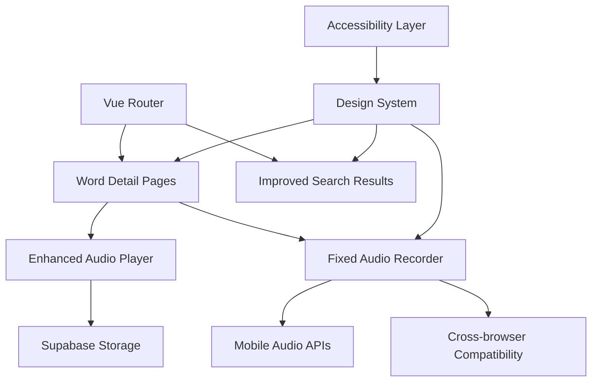

# Design Document

## Overview

This design focuses on enhancing the user interface and user experience through three main areas: creating comprehensive word detail pages, fixing and improving the audio recording functionality with mobile compatibility, and implementing a cleaner, more accessible UI design system. The improvements will maintain the existing offline-first architecture while providing a more polished and reliable user experience.

## Architecture

### High-Level Architecture Changes



### Component Architecture

**New Page Components:**
- `WordDetailPage.vue` - Comprehensive word information display
- `AudioRecordingPage.vue` - Dedicated recording interface

**Enhanced Components:**
- `AudioRecorder.vue` - Rebuilt with mobile compatibility
- `AudioPlayerTaigi.vue` - Enhanced with better UI
- Search result cards - Improved visual hierarchy

**New Utility Components:**
- `LoadingSkeletons.vue` - Better loading states
- `ErrorBoundary.vue` - Graceful error handling
- `AccessibilityWrapper.vue` - ARIA and keyboard support

## Components and Interfaces

### Word Detail Page Design

**WordDetailPage.vue Structure:**
```vue
<template>
  <div class="word-detail-page">
    <!-- Header Section -->
    <WordHeader 
      :word="wordData"
      :pronunciation-available="hasAudio"
    />
    
    <!-- Official Dictionary Sources -->
    <OfficialDefinitions 
      :moe-data="moeDefinitions"
      :mknoll-data="mknollDefinitions"
      :cedict-data="cedictDefinitions"
    />
    
    <!-- Community Definitions (if available) -->
    <CommunityDefinitions 
      v-if="communityDefinitions.length"
      :definitions="communityDefinitions"
    />
    
    <!-- Audio Section -->
    <AudioSection 
      :word-id="wordId"
      :existing-audio="audioFiles"
      @audio-recorded="handleNewAudio"
    />
    
    <!-- Related Words -->
    <RelatedWords :word="wordData" />
  </div>
</template>
```

### Enhanced Audio Recording System

**Mobile-Compatible Audio Recording:**
```javascript
class MobileAudioRecorder {
  constructor() {
    this.mediaRecorder = null;
    this.audioChunks = [];
    this.stream = null;
  }

  async initialize() {
    // Check for mobile-specific constraints
    const constraints = {
      audio: {
        echoCancellation: true,
        noiseSuppression: true,
        sampleRate: 44100,
        // Mobile-specific optimizations
        ...(this.isMobile() && {
          channelCount: 1,
          sampleSize: 16
        })
      }
    };

    try {
      this.stream = await navigator.mediaDevices.getUserMedia(constraints);
      this.setupMediaRecorder();
    } catch (error) {
      this.handlePermissionError(error);
    }
  }

  setupMediaRecorder() {
    // Use appropriate MIME type for mobile compatibility
    const mimeType = this.getSupportedMimeType();
    this.mediaRecorder = new MediaRecorder(this.stream, { mimeType });
    
    this.mediaRecorder.ondataavailable = (event) => {
      this.audioChunks.push(event.data);
    };
  }

  getSupportedMimeType() {
    const types = [
      'audio/webm;codecs=opus',
      'audio/webm',
      'audio/mp4',
      'audio/wav'
    ];
    
    return types.find(type => MediaRecorder.isTypeSupported(type)) || '';
  }
}
```

### Design System Implementation

**CSS Custom Properties for Consistency:**
```css
:root {
  /* Typography Scale */
  --font-size-xs: 0.75rem;
  --font-size-sm: 0.875rem;
  --font-size-base: 1rem;
  --font-size-lg: 1.125rem;
  --font-size-xl: 1.25rem;
  --font-size-2xl: 1.5rem;
  --font-size-3xl: 1.875rem;

  /* Spacing Scale */
  --space-1: 0.25rem;
  --space-2: 0.5rem;
  --space-3: 0.75rem;
  --space-4: 1rem;
  --space-6: 1.5rem;
  --space-8: 2rem;

  /* Color Palette */
  --color-primary: #3b82f6;
  --color-secondary: #64748b;
  --color-success: #10b981;
  --color-warning: #f59e0b;
  --color-error: #ef4444;
  
  /* Semantic Colors */
  --color-text-primary: #1f2937;
  --color-text-secondary: #6b7280;
  --color-background: #ffffff;
  --color-surface: #f9fafb;
  --color-border: #e5e7eb;

  /* Component-specific */
  --color-official-content: #dbeafe;
  --color-community-content: #fef3c7;
  --color-recording-active: #fecaca;
}
```

## Data Models

### Enhanced Word Detail Model
```typescript
interface WordDetailData {
  id: string;
  chinese: string;
  romanization: string;
  english: string[];
  
  // Official sources
  moeDefinitions: MoeDefinition[];
  mknollDefinitions: MknollDefinition[];
  cedictDefinitions: CedictDefinition[];
  
  // Community content
  communityDefinitions: CommunityDefinition[];
  
  // Audio data
  audioFiles: AudioFile[];
  hasOfficialAudio: boolean;
  
  // Metadata
  frequency: number;
  difficulty: string;
  tags: string[];
  relatedWords: RelatedWord[];
}
```

### Audio Recording State Model
```typescript
interface AudioRecordingState {
  status: 'idle' | 'requesting-permission' | 'recording' | 'paused' | 'processing' | 'uploading' | 'complete' | 'error';
  duration: number;
  audioBlob: Blob | null;
  audioUrl: string | null;
  error: AudioError | null;
  uploadProgress: number;
  waveformData: number[];
}

interface AudioError {
  type: 'permission-denied' | 'not-supported' | 'network-error' | 'format-error';
  message: string;
  suggestions: string[];
}
```

## Error Handling

### Audio Recording Error Handling
```javascript
class AudioErrorHandler {
  static handleRecordingError(error) {
    switch (error.name) {
      case 'NotAllowedError':
        return {
          type: 'permission-denied',
          message: 'Microphone access was denied',
          suggestions: [
            'Click the microphone icon in your browser\'s address bar',
            'Go to browser settings and allow microphone access',
            'Try refreshing the page and allowing access when prompted'
          ]
        };
      
      case 'NotFoundError':
        return {
          type: 'not-supported',
          message: 'No microphone found',
          suggestions: [
            'Check that your microphone is connected',
            'Try using a different browser',
            'Check your device\'s audio settings'
          ]
        };
      
      case 'NotSupportedError':
        return {
          type: 'not-supported',
          message: 'Audio recording not supported',
          suggestions: [
            'Try using a modern browser like Chrome or Firefox',
            'Update your browser to the latest version',
            'Use the desktop version of the app'
          ]
        };
      
      default:
        return {
          type: 'network-error',
          message: 'Recording failed',
          suggestions: ['Please try again', 'Check your internet connection']
        };
    }
  }
}
```

### Mobile-Specific Error Handling
- iOS Safari audio recording limitations
- Android Chrome permission handling
- Cross-browser MIME type compatibility
- Network timeout handling for uploads

## Testing Strategy

### Component Testing
- Word detail page rendering with various data combinations
- Audio recorder state management across different scenarios
- Mobile touch interaction testing
- Accessibility compliance testing

### Cross-Browser Testing
- Audio recording functionality across major browsers
- Mobile browser compatibility (iOS Safari, Android Chrome)
- Progressive enhancement for unsupported features
- Responsive design testing on various screen sizes

### User Experience Testing
- Navigation flow from search results to detail pages
- Audio recording workflow on mobile devices
- Loading state and error handling user experience
- Accessibility testing with screen readers

## Performance Considerations

### Page Loading Optimization
- Lazy loading of audio files and community content
- Skeleton screens for better perceived performance
- Image optimization for word illustrations
- Code splitting for detail page components

### Audio Recording Performance
- Efficient audio chunk handling for long recordings
- Background upload with progress indication
- Audio compression before upload
- Cleanup of audio resources and streams

### Mobile Performance
- Touch event optimization
- Reduced motion for battery conservation
- Efficient DOM updates during recording
- Memory management for audio data

## Accessibility Implementation

### ARIA Labels and Semantic HTML
```html
<section aria-labelledby="official-definitions-heading">
  <h2 id="official-definitions-heading">Official Dictionary Definitions</h2>
  <div role="list" aria-label="Dictionary definitions">
    <article role="listitem" aria-labelledby="moe-definition">
      <h3 id="moe-definition">Ministry of Education Definition</h3>
      <!-- Definition content -->
    </article>
  </div>
</section>

<div class="audio-recorder" role="application" aria-label="Audio pronunciation recorder">
  <button 
    aria-describedby="record-instructions"
    aria-pressed="false"
    :aria-label="recordingState === 'recording' ? 'Stop recording' : 'Start recording'"
  >
    Record
  </button>
  <div id="record-instructions" class="sr-only">
    Press to start recording your pronunciation. Press again to stop.
  </div>
</div>
```

### Keyboard Navigation
- Tab order optimization for logical flow
- Custom focus management for modal dialogs
- Keyboard shortcuts for common actions
- Focus trapping in recording interface

### Screen Reader Support
- Descriptive text for audio controls
- Status announcements for recording state
- Alternative text for visual indicators
- Structured heading hierarchy

## Mobile-Specific Design Considerations

### Touch Interface Design
- Minimum 44px touch targets
- Appropriate spacing between interactive elements
- Swipe gestures for navigation
- Haptic feedback for recording actions

### iOS Safari Considerations
- Audio recording requires user gesture
- Specific MIME type requirements
- Memory limitations for audio processing
- Viewport meta tag optimization

### Android Chrome Considerations
- Permission request timing
- Audio format compatibility
- Performance optimization for older devices
- Network handling for slow connections