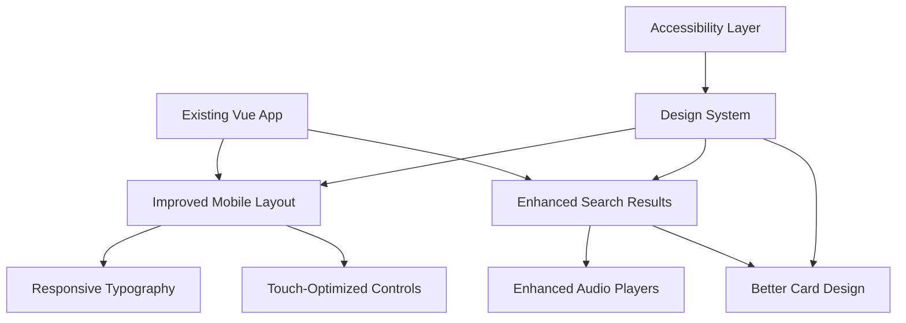

# Design Document

## Overview

This design focuses on enhancing the user interface and user experience of the existing Taiwanese dictionary app by improving visual consistency, optimizing mobile responsiveness, enhancing search result presentation, and creating a more polished overall design. The improvements will build upon the current Vue.js architecture while maintaining the existing offline-first functionality.

## Architecture

### High-Level Architecture Changes



### Component Enhancement Strategy

**Enhanced Existing Components:**
- `MoeResultCard.vue` - Improved visual hierarchy and spacing
- `MknollResultCard.vue` - Better typography and layout
- `DictionarySearch.vue` - Enhanced search interface
- `RandomWord.vue` - Improved visual presentation
- `AudioPlayerTaigi.vue` - Better UI and controls

**New Utility Components:**
- `LoadingSkeleton.vue` - Better loading states
- `EmptyState.vue` - Improved empty result displays
- `TouchTarget.vue` - Consistent touch-friendly elements

## Components and Interfaces

### Enhanced Search Result Cards

**Improved MoeResultCard Design:**
```vue
<template>
  <article class="moe-result-card">
    <!-- Primary language content with enhanced typography -->
    <header class="card-header">
      <div class="primary-content">
        <!-- Taiwanese/Chinese/English based on search language -->
      </div>
      <div class="card-actions">
        <!-- Favorite, Edit, Add Definition buttons -->
      </div>
    </header>
    
    <!-- Secondary language content -->
    <div class="secondary-content">
      <!-- Other language variants -->
    </div>
    
    <!-- Definitions with improved formatting -->
    <div class="definitions">
      <!-- Enhanced definition display -->
    </div>
    
    <!-- Audio controls with better UI -->
    <div class="audio-section">
      <!-- Improved audio player -->
    </div>
  </article>
</template>
```

### Design System Implementation

**Enhanced CSS Custom Properties:**
```css
:root {
  /* Existing colors maintained for consistency */
  --black: #0a0a0a;
  --raisinBlack: #1a1d29;
  --gunmetal: #2d3143;
  --slateGray: #6e83a0;
  --frenchGray: #acabb5;
  --white: #f3f3f3;

  /* Enhanced typography scale */
  --font-size-xs: 0.75rem;    /* 12px */
  --font-size-sm: 0.875rem;   /* 14px */
  --font-size-base: 1rem;     /* 16px */
  --font-size-lg: 1.125rem;   /* 18px */
  --font-size-xl: 1.25rem;    /* 20px */
  --font-size-2xl: 1.5rem;    /* 24px */
  --font-size-3xl: 1.875rem;  /* 30px */
  --font-size-4xl: 2.25rem;   /* 36px */

  /* Consistent spacing scale */
  --space-1: 0.25rem;  /* 4px */
  --space-2: 0.5rem;   /* 8px */
  --space-3: 0.75rem;  /* 12px */
  --space-4: 1rem;     /* 16px */
  --space-5: 1.25rem;  /* 20px */
  --space-6: 1.5rem;   /* 24px */
  --space-8: 2rem;     /* 32px */
  --space-10: 2.5rem;  /* 40px */
  --space-12: 3rem;    /* 48px */

  /* Border radius scale */
  --radius-sm: 0.125rem;  /* 2px */
  --radius-md: 0.25rem;   /* 4px */
  --radius-lg: 0.5rem;    /* 8px */
  --radius-xl: 0.75rem;   /* 12px */

  /* Shadow system */
  --shadow-sm: 0 1px 2px 0 rgba(0, 0, 0, 0.05);
  --shadow-md: 0 4px 6px -1px rgba(0, 0, 0, 0.1);
  --shadow-lg: 0 10px 15px -3px rgba(0, 0, 0, 0.1);

  /* Touch target sizes */
  --touch-target-min: 44px;
  --touch-target-comfortable: 48px;

  /* Animation timing */
  --transition-fast: 150ms ease;
  --transition-normal: 250ms ease;
  --transition-slow: 350ms ease;
}
```

### Mobile-First Responsive Design

**Responsive Breakpoints:**
```css
/* Mobile-first approach */
.component {
  /* Mobile styles (default) */
  padding: var(--space-4);
  font-size: var(--font-size-base);
}

/* Tablet and up */
@media (min-width: 768px) {
  .component {
    padding: var(--space-6);
    font-size: var(--font-size-lg);
  }
}

/* Desktop and up */
@media (min-width: 1024px) {
  .component {
    padding: var(--space-8);
  }
}
```

### Enhanced Card Design System

**Card Component Structure:**
```css
.result-card {
  background: var(--black);
  border-radius: var(--radius-lg);
  padding: var(--space-4);
  margin-bottom: var(--space-4);
  border: 1px solid var(--gunmetal);
  transition: var(--transition-normal);
  position: relative;
}

.result-card:hover {
  border-color: var(--slateGray);
  box-shadow: var(--shadow-md);
  transform: translateY(-1px);
}

.card-header {
  display: flex;
  justify-content: space-between;
  align-items: flex-start;
  margin-bottom: var(--space-3);
}

.primary-content {
  flex: 1;
  min-width: 0; /* Prevent flex item overflow */
}

.card-actions {
  display: flex;
  gap: var(--space-2);
  flex-shrink: 0;
}
```

## Data Models

### Enhanced UI State Models
```typescript
interface CardDisplayState {
  primaryLanguage: 'taiwanese' | 'chinese' | 'english';
  showSecondaryLanguages: boolean;
  isExpanded: boolean;
  audioAvailable: boolean;
  isLoading: boolean;
}

interface TouchInteractionState {
  isPressed: boolean;
  touchStartTime: number;
  touchPosition: { x: number; y: number };
}

interface ResponsiveState {
  screenSize: 'mobile' | 'tablet' | 'desktop';
  orientation: 'portrait' | 'landscape';
  touchDevice: boolean;
}
```

## Visual Hierarchy and Typography

### Typography System
```css
/* Language-specific typography */
.taiwanese-text {
  font-family: "Noto Sans", sans-serif;
  font-weight: 400;
  line-height: 1.4;
}

.chinese-text {
  font-family: "Noto Sans CJK TC", "Noto Sans", sans-serif;
  font-weight: 400;
  line-height: 1.3;
}

.english-text {
  font-family: "Helvetica Neue", "Noto Sans", sans-serif;
  font-weight: 400;
  line-height: 1.5;
}

/* Size variations based on importance */
.primary-language {
  font-size: var(--font-size-2xl);
  font-weight: 500;
  color: var(--white);
  margin-bottom: var(--space-2);
}

.secondary-language {
  font-size: var(--font-size-lg);
  color: var(--frenchGray);
  margin-bottom: var(--space-1);
}

.definition-text {
  font-size: var(--font-size-base);
  color: var(--frenchGray);
  line-height: 1.6;
}
```

## Touch and Mobile Optimization

### Touch Target Guidelines
```css
.touch-target {
  min-height: var(--touch-target-min);
  min-width: var(--touch-target-min);
  display: flex;
  align-items: center;
  justify-content: center;
  position: relative;
}

.touch-target::before {
  content: '';
  position: absolute;
  top: 50%;
  left: 50%;
  transform: translate(-50%, -50%);
  min-height: var(--touch-target-comfortable);
  min-width: var(--touch-target-comfortable);
  border-radius: 50%;
  background: transparent;
}

/* Touch feedback */
.touch-target:active {
  transform: scale(0.95);
  transition: transform 100ms ease;
}
```

### Mobile Layout Adaptations
```css
@media (max-width: 767px) {
  .search-results {
    padding: var(--space-2);
  }
  
  .result-card {
    margin-bottom: var(--space-3);
    padding: var(--space-3);
  }
  
  .card-actions {
    position: absolute;
    top: var(--space-2);
    right: var(--space-2);
    background: rgba(0, 0, 0, 0.8);
    border-radius: var(--radius-md);
    padding: var(--space-1);
  }
  
  .primary-language {
    font-size: var(--font-size-xl);
    padding-right: var(--space-12); /* Space for actions */
  }
}
```

## Loading States and Feedback

### Skeleton Loading Design
```css
.skeleton {
  background: linear-gradient(
    90deg,
    var(--gunmetal) 25%,
    var(--slateGray) 50%,
    var(--gunmetal) 75%
  );
  background-size: 200% 100%;
  animation: skeleton-loading 1.5s infinite;
  border-radius: var(--radius-md);
}

@keyframes skeleton-loading {
  0% { background-position: 200% 0; }
  100% { background-position: -200% 0; }
}

.skeleton-text {
  height: 1em;
  margin-bottom: var(--space-2);
}

.skeleton-text.large {
  height: 1.5em;
}

.skeleton-text.small {
  height: 0.75em;
  width: 60%;
}
```

## Accessibility Implementation

### Focus Management
```css
.focusable {
  outline: none;
  position: relative;
}

.focusable:focus-visible::after {
  content: '';
  position: absolute;
  top: -2px;
  left: -2px;
  right: -2px;
  bottom: -2px;
  border: 2px solid var(--color-primary);
  border-radius: var(--radius-md);
  pointer-events: none;
}

/* High contrast mode support */
@media (prefers-contrast: high) {
  .result-card {
    border-width: 2px;
  }
  
  .primary-language {
    font-weight: 600;
  }
}

/* Reduced motion support */
@media (prefers-reduced-motion: reduce) {
  * {
    animation-duration: 0.01ms !important;
    animation-iteration-count: 1 !important;
    transition-duration: 0.01ms !important;
  }
}
```

### Screen Reader Support
```html
<!-- Enhanced semantic structure -->
<article class="result-card" role="article" aria-labelledby="word-title-123">
  <header class="card-header">
    <h3 id="word-title-123" class="visually-hidden">
      Dictionary entry for {{ word.chinese }}
    </h3>
    <div class="primary-content" aria-label="Primary word content">
      <!-- Word content -->
    </div>
  </header>
  
  <div class="definitions" role="list" aria-label="Word definitions">
    <div role="listitem" v-for="def in definitions">
      <!-- Definition content -->
    </div>
  </div>
  
  <div class="audio-section" aria-label="Audio pronunciation">
    <!-- Audio controls -->
  </div>
</article>
```

## Performance Considerations

### Efficient Rendering
- Use `v-memo` for expensive list items
- Implement virtual scrolling for large result sets
- Optimize image loading with lazy loading
- Use CSS containment for better paint performance

### Memory Management
- Clean up event listeners on component unmount
- Optimize audio resource cleanup
- Use weak references where appropriate
- Implement proper garbage collection for large datasets

### Bundle Optimization
- Code splitting for non-critical features
- Tree shaking for unused utilities
- Optimize CSS delivery
- Compress and optimize assets

## Testing Strategy

### Visual Regression Testing
- Screenshot testing for component variations
- Cross-browser visual consistency
- Mobile layout verification
- Dark mode appearance testing

### Accessibility Testing
- Automated accessibility scanning
- Screen reader testing
- Keyboard navigation verification
- Color contrast validation

### Performance Testing
- Core Web Vitals monitoring
- Mobile performance benchmarking
- Memory usage profiling
- Network performance optimization

### User Experience Testing
- Touch interaction testing on real devices
- Loading state user experience
- Error handling user flows
- Cross-platform consistency verification